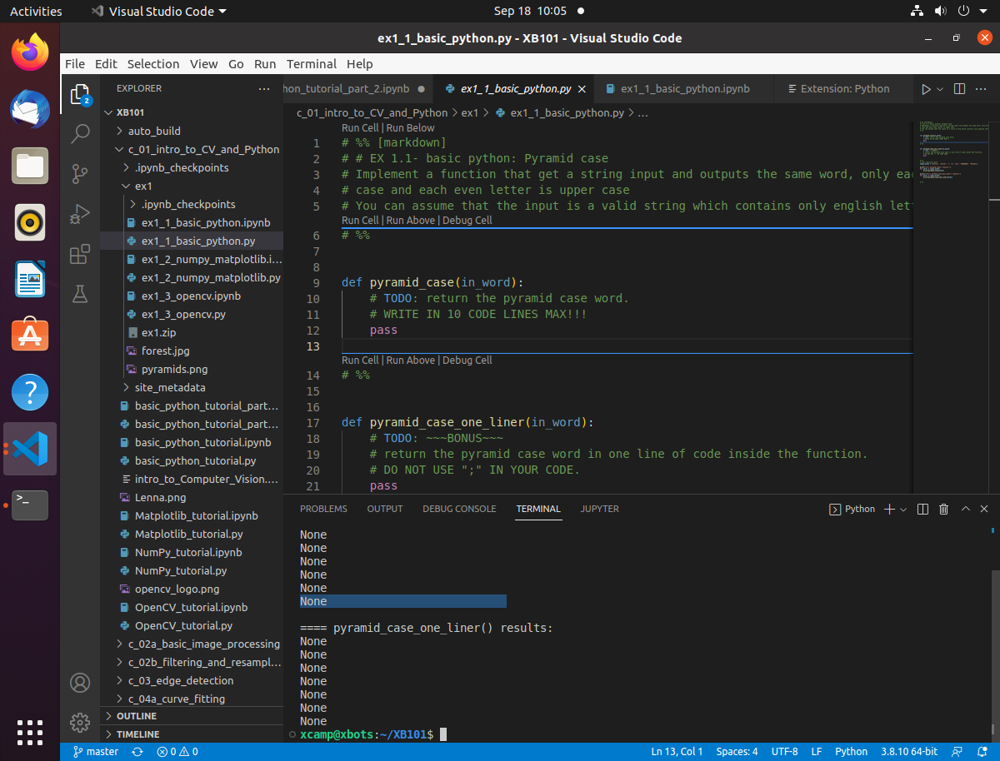
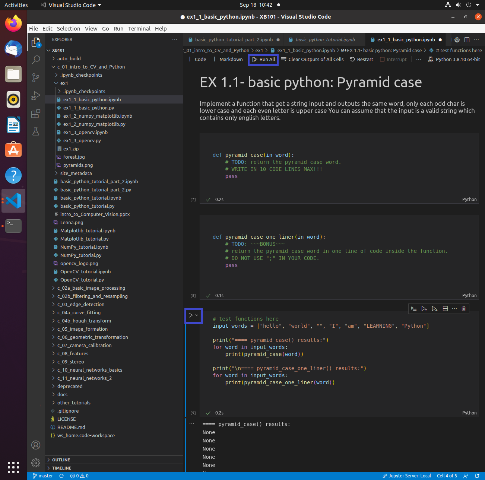
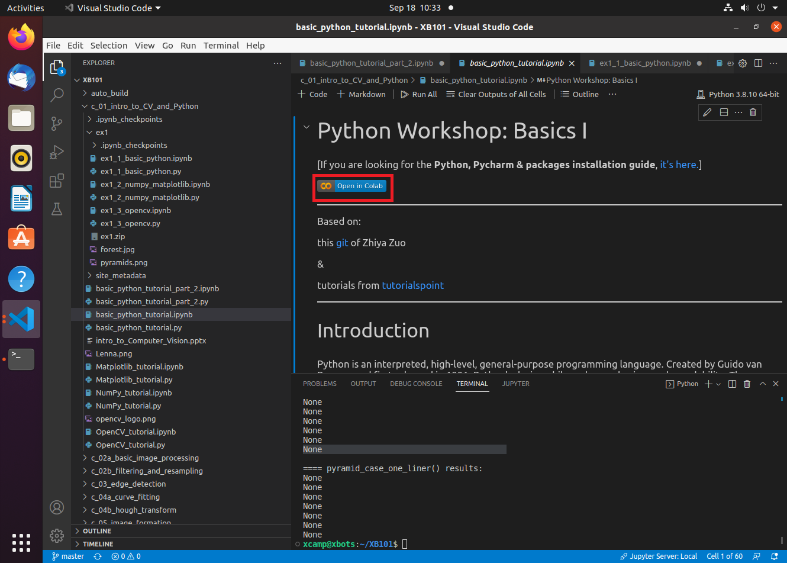
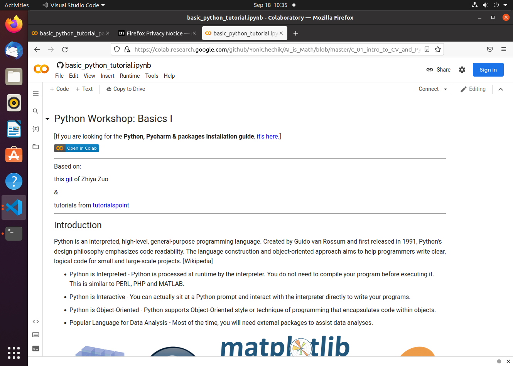

# XB101: Robotic Vision and LiDAR Map

## [Course TOC](https://github.com/chuanqichen/XB101/blob/master/TOC.md)

## Get this repository and always get latest before starting every lab
```
** For the first lab, start from home directory in your Ubuntu terminal: 
cd 
git clone https://github.com/chuanqichen/XB101.git
sudo apt install python3-pip
sudo pip install numpy scipy matplotlib 
sudo pip install notebook ipykernel
** get latest update in subsequent labs 
cd XB101
git pull
```

## How to run the code and do homework assignments 
Open vscode, Click "File" -> "Open Folder" and browse to open ~/XB101, you should have following vscode window.  

There are two methods to do your homework assignment: 
### Run Python code locally 
* Refer to below screenshot, click "ex1_1_basic_python.py"
* then press "Run" (the red highlight button in top right corner) 


### Run Jupyter Notebook version locally 
Alternatively, you can run the Jupyter Notebook version of the code ex1_1_basic_python.ipynb
* Refer to following screenshot, click "ex1_1_basic_python.ipynb"
* then press "Run All" (the red highlight button in the middle) 
* or you can run the code section by section click "Run" (blue highlight button in the left side of the code), you need run from top to bottom section by section. 


## Google Colab 
Some codes, you can run the code using Google Colab so that you can take advantage of free GPU resources. 

Refer to this tutorial jupyer notebook: <br>


Click "Open in Colab" (highighted in red), then you can read and run the code on the following browser: 



